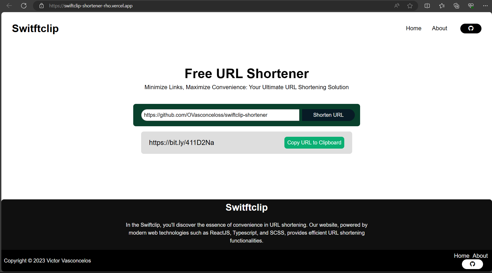

# Swiftclip URL Shortener

<div align="center">

  

</div>
<hr>

It consists of a website that offers URL shortening functionalities, providing a quick and convenient way to share links. Developed with modern web technologies (ReactJS, Typescript, SCSS), the URL shortener simplifies long addresses, making them more manageable and easier to share on online platforms.

### Installing

```bash
npm run dev
# or
yarn dev
# or
pnpm dev
# or
bun dev
```

## Deployment

Add additional notes to deploy this on a live system

## Built With

  - [SCSS](https://sass-lang.com/)
  - [ReactJS](https://react.dev/)
  - [Typescript](https://www.typescriptlang.org/)

## Contributions

Feel free to contribute to this project! To contribute, follow the steps below:

1. **Clone the Repository:**
```bash
git clone https://github.com/OVasconceloss/swiftclip-shortener.git
```

## Authors

  - **Victor Vasconcelos** | Developer
    [OVasconceloss](https://github.com/OVasconceloss)
  - **Billie Thompson** | Provided README Template
    [PurpleBooth](https://github.com/PurpleBooth)

## License

Creative Commons License - see the [LICENSE.md](./LICENSE.md) file for
details